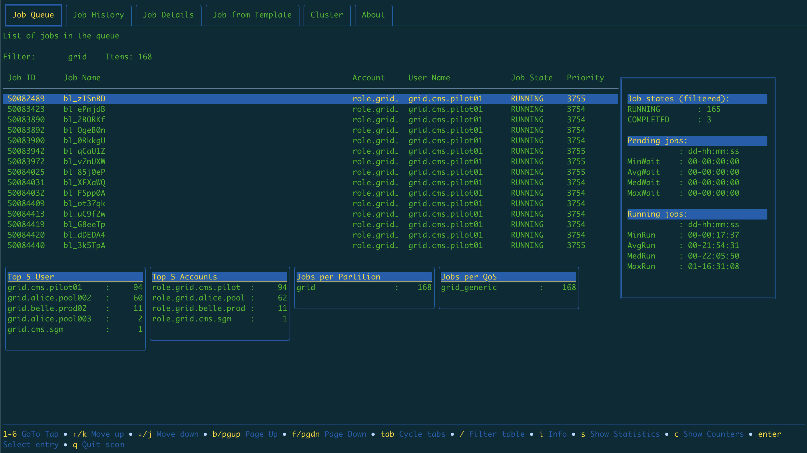
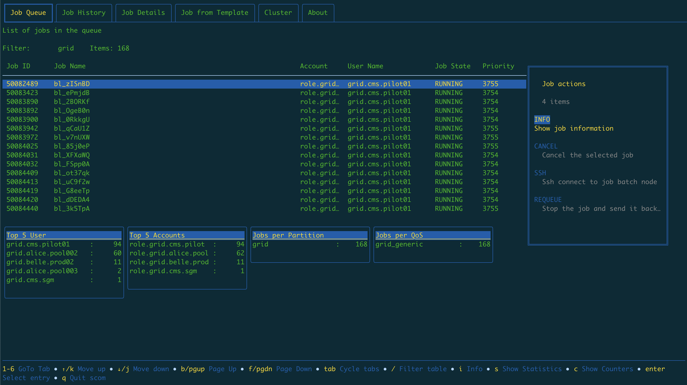
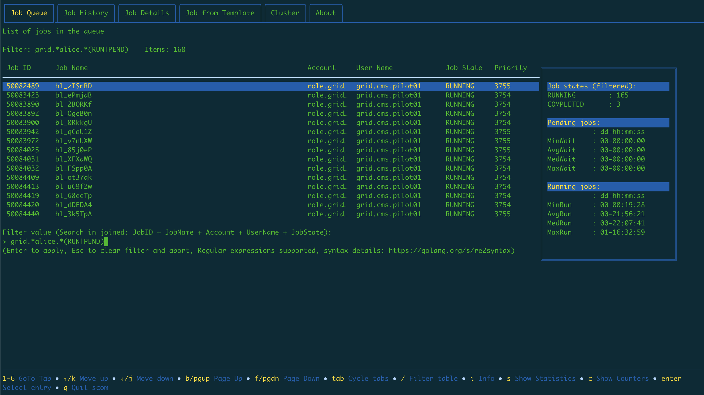
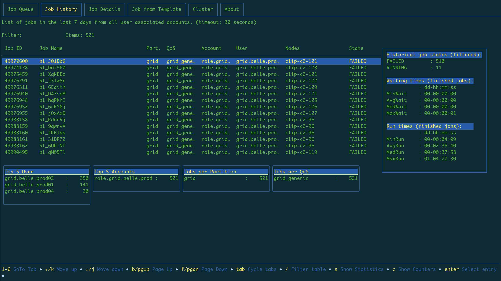
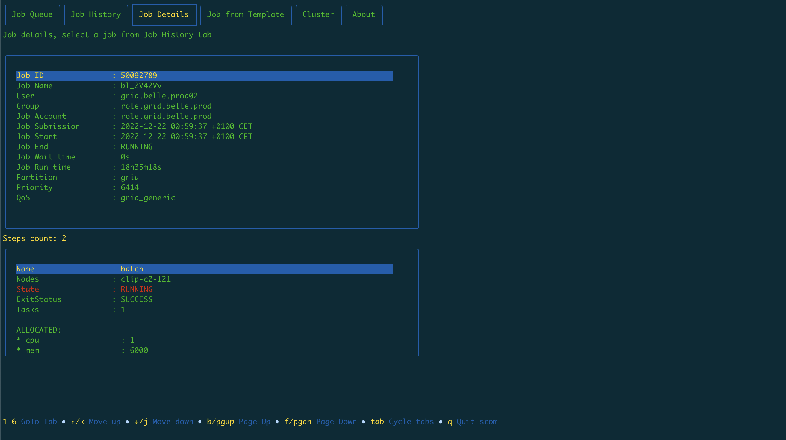
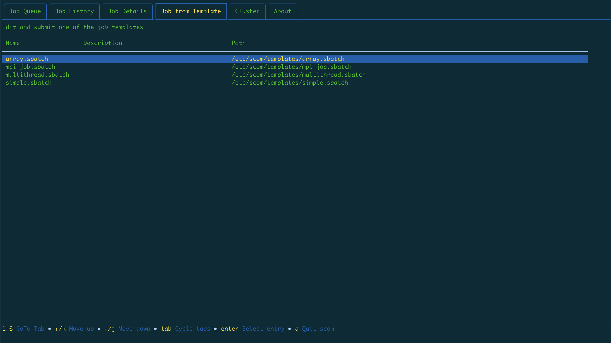
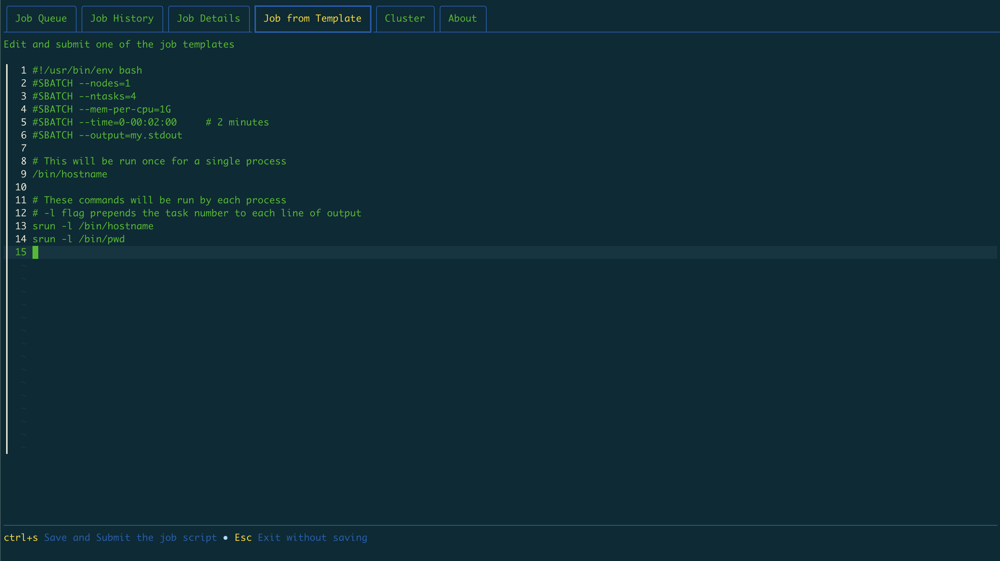
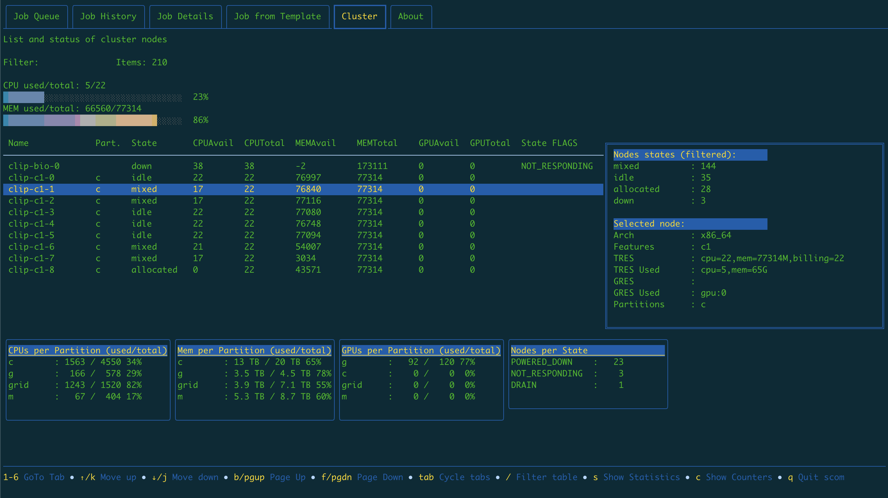
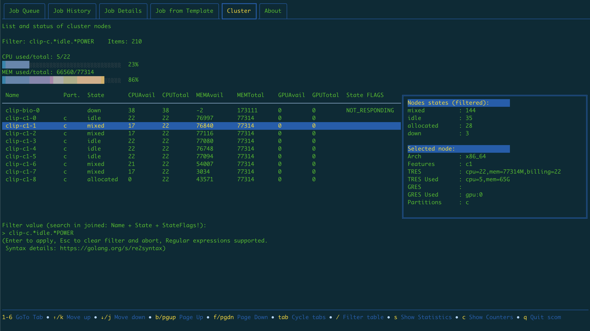
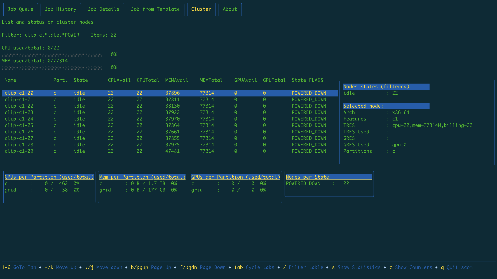

# SlurmCommander

> ## News:
>
> [Discussions](https://github.com/CLIP-HPC/SlurmCommander/discussions) are open!
>
> Wishlist discussion thread: [here](https://github.com/CLIP-HPC/SlurmCommander/discussions/20)

## Description

SlurmCommander is a simple, lightweight, no-dependencies text-based user interface (TUI) to your cluster.
It ties together multiple slurm commands to provide you with a simple and efficient interaction point with slurm.

[Installation](#installation) does not require any special privileges or environment. Simply download the [binary](https://github.com/CLIP-HPC/SlurmCommander/releases/latest), fill out a small [config file](./cmd/scom/scom.conf) and it's ready to run.

You can view, search, analyze and interact with:

### Job Queue 

Job Queue shows jobs currently in the queue, additional information and breakdowns can be turned on with `s`,`c` and `i` keys:


`Enter` key opens menu window with different actions available based on the job state (RUNNING, PENDING, etc.)


`\` turns on __filtering__. It works by concatenating multiple job columns into a single string, and accepts [golang re2 regular expressions](https://github.com/google/re2/wiki/Syntax) thus allowing you to do some very imaginative filters.

Example: `grid.*alice.\*(RUN|PEND)` =~ _jobs from account grid, user alice, in RUNNING OR PENDING state_


### Job history 

Browse, filter and inspect past jobs




### Edit and submit jobs from predefined templates

* In the config file, set the `templatedirs` list of directories where to look for _.sbatch_ templates and their _.desc_ description files




### Examine state of cluster nodes and partitions



Same as with _Job Queue_ and _Job History_ tabs, filtering is available here.


So if we would like to see only nodes whose name contains _clip-c_ that are _idle_ and _POWERED\_DOWN_, we can easily filter those out with a filter: `clip-c.*idle.\*POWER`



### Example Job Queue tab demo:


## Installation

SlurmCommander does not require any special privileges to be installed, see instructions below.

> Hard requirement: json-output capable slurm commands

### Regular users

1. Download the pre-built [binary](https://github.com/CLIP-HPC/SlurmCommander/releases/latest)
2. Download the [annotated config](./cmd/scom/scom.conf) file
3. Edit the config file, follow instructions inside
4. Create scom directory in your $HOME and place the edited config there: `mkdir $HOME/scom`
5. Run

### Site administrators

Instructions are same as for the regular users, with one minor perk. 
Place the [config file](./cmd/scom/scom.conf) in one of the following locations to be used as global configuration source for all scom instances on that machine.

1. /etc/scom/scom.conf
2. Any location, providing users with the environment variable `SCOM_CONF` containing path to config. file
3. Users $XDG_CONFIG_HOME/scom/scom.conf


__NOTE__: Users can still override global configuration options by changing config stanzas in their local `$HOME/scom/scom.conf`

## Usage tips

SlurmCommander is developed for 256 color terminals (black background) and requires at least 185x43 (columns x rows) to work.

* If you experience _funky_ colors on startup, try setting your `TERM` environment variable to something like `xterm-256color`.
* If you get a message like this:
`FATAL: Window too small to run without breaking view. Have 80x24. Need at least 185x43.`, check your terminal resolution with `stty -a` and try resizing the window or reduce the font.


```
[pja@ SlurmCommander-dev]$ [DEBUG=1] [TERM=xterm-256color]./scom -h
Welcome to Slurm Commander!

Usage of ./scom:
  -d uint
        Jobs history fetch last N days (default 7)
  -t uint
        Job history fetch timeout, seconds (default 30)
  -v    Display version

```

To run in _debug_ mode, set `DEBUG` env. variable. You will see an extra debug message line in the user interface and scom will record a `scdebug.log` file with (_lots of_) internal log messages.

> Tested on: 
> * slurm 21.08.8
> * slurm 22.05.5

## Feedback

__Is most welcome. Of any kind.__

* bug reports
* broken UI elements
* code panic reports
* ideas
* wishes
* code contributions
* usage stories
* kudos
* coffee and/or beer
* ...

## Acknowledgments

Powered by amazing [Bubble Tea](https://github.com/charmbracelet/bubbletea) framework/ecosystem. Kudos to glamurous Charm developers and community.

